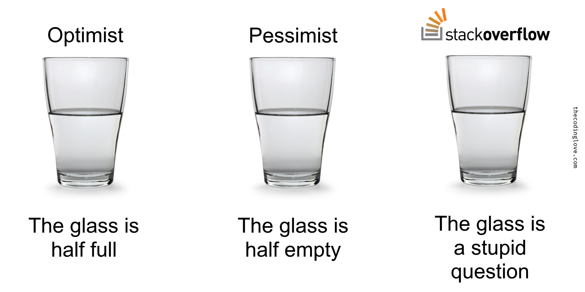

## Engineer's Toolbox
Throughout my undergraduate career as a computer engineering student, I have always been told that communication is the most important skill engineers must possess. I have taken that to heart throughout my collaborative projects and workplaces, and I’ve realized that asking questions makes up the largest part of that communication skill. I have also seen firsthand that poorly worded questions can waste time for both the person asking and the person trying to answer. A great place to see this in action is Stack Overflow, where many software engineers post their unique questions and receive answers from people with more experience. At first, I didn’t have even a basic understanding of how to ask proper questions, but after reading Raymond’s essay I’m definitely keeping a good note of a few important things.

## A Smart Question
A smart question is something like the post titled “Better way to search for a node in a binary tree.” 
```
Q: Better way to search for a node in binary tree

This is the code I have written for searching a node in a tree as a part of my assignment:

typedef struct NODE
{
    int key; 
    struct NODE *left, *right; 
} Node;

Node *search(Node *head, int key)
{
    if (!head)
        return 0; 
    if (head->key == key)
        return head; 
    
    return or(search(head->left, key), search(head->right, key)); 
}

Node *or(void *ptr1, void *ptr2)
{
    Node *temp = (Node *)((long)ptr1 | (long)ptr2);
    return temp;
}
I wrote a recursive function because it's the 1st thing that comes to mind when you want to scan a tree. This was supposed to be simple, but it quickly became a dance with pointers (had to do bitwise OR on the Node* pointers).

The function analyzes the left and right sub-trees of a node, returning NULL if node is not found, or the Node address if the key gets matched. In the end, we do a bitwise OR on the two pointers returned which enables us to return the non-zero node address if the key gets matched.

Although this isn't too much code (and it works), I think it is more complicated than necessary. Can anyone recommend a simpler technique? (Recursive preferred)

edit:

Node *left = search(head->left,key) ;
if(left)
return left ; 
else 
return search(head->right,key) ;
This was simply what I could have done without involving myself with bitwise operations on pointers.
```
In this case, the person was asking for a better approach to searching a binary tree than the one they had already written. First, the title is clear, it describes exactly what the question is and what the asker wants. Second, they provide their own code and describe their thought process when first approaching the problem, which shows real effort to solve it on their own. For example, they initially tried a recursive function but found it became too complicated when dealing with pointers. Third, they clearly explain their expectations, the code works, but it feels unnecessarily complex, and they are looking for a simpler, less confusing way to achieve the same goal. This is a strong example of how to ask a smart question that follows the principles in Raymond’s essay.
```
A: Your original approach only works if you can make these assumptions:

type long is wide enough for the conversion from Node* to long and back to yield the original pointer. This is true on 32-bit systems and 64-bit Unix systems, but not on 64-bit Windows where long is only 32-bit wide and pointers require 64 bits.
there is at most one Node* with the key value in the tree. Otherwise or-ing the bits of the matching pointers will produce a meaningless result that will invoke undefined behavior.
performance is not needed as this implementation walks the whole tree for every search with a linear complexity instead of the expected Log(N) complexity.
I wrote original because I have never seen anyone else do it this way! Sadly, it is not a good approach because it is inefficient, non portable and risky, but creativity is a good skill to hone in programming.

Assuming your binary tree is actually constructed as a binary search tree, the classic approach for a look up is to compare the key with the node value and recurse only on the left or right branch as needed:

typedef struct NODE {
    int key; 
    struct NODE *left, *right; 
} Node;

Node *search(Node *head, int key) {
    if (!head)
        return NULL; 
    if (key == head->key)
        return head; 
    if (key < head->key)
        return search(head->left, key);
    else
        return search(head->right, key);
}
This can be simplified a bit with a single terminal recursion:

Node *search(Node *head, int key) {
    if (!head || key == head->key)
        return head;
    else 
        return search(key < head->key ? head->left : head->right, key);
}
Note that an iterative version might perform better:

Node *search(Node *head, int key) {
    while (head && key != head->key) {
        head = key < head->key ? head->left : head->right;
    }
    return head; 
}
Finally, here is a cryptic alternative with fewer branches(*):

Node *search(Node *head, int key) {
    while (head && key != head->key) {
        head = (key > head->key)[&head->left];
    }
    return head; 
}
If the tree is not sorted (just an ordinary binary tree), you may have to explore the whole tree this way:

Node *search(Node *head, int key) {
    if (!head || key == head->key)
        return head; 
    Node *n = search(head->left, key);
    return n ? n : search(head->right, key);
}
(*) Please do not use this kind of code in production, this is just a cryptic example for educational purpose. Here is an explanation: in C a[b] is the same as *(a+b) which is commutative so you can swap the pointer and the index as well and write b[a] with the same effect. (key > head->key) has the value 0 or 1 depending on the comparison, &head->left is the address of the left structure member, adding 1 to this address gives the address of the right member (a tad abusive but should work). So this expression selects the left or right member based on the comparison without an actual branch on modern processors.
```
This question received an excellent response that gave more than enough information to fully answer the question. It also included helpful tips on why the original code should not be used in production. This question was a fantastic smart question that was able to get a more than helpful answer.

## A Not Smart Question

This next example is not from a real Stack Overflow post, but it illustrates what a bad question looks like. Imagine a title such as “Help me fix my code fast!!!” this already gives a very vague description with no real information about the problem. 
```
Q: Help me fix my code fast!!!

My program is supposed to build a binary tree but it keeps giving me errors.
Here’s the code:

int main() {
Node* root;
insert(root, 10);
insert(root, 20)
insert(root 30);
// it crashes here
}

I need to turn this in soon!!!
```
The body of the question provides no background about what the person is trying to achieve and simply pastes some broken code with the expectation that others will fix it. This leaves readers confused because they cannot clearly understand what the actual issue is. On top of that, the question shows no prior effort in trying to solve the problem, which makes it look careless. Adding a sense of urgency (“fast!!!”) further discourages people from helping because it feels like the opportunity to provide meaningful guidance has already passed. 
```
A: What language is this supposed to be? Please add details.

A: Can you post the full error message? We can’t help without it.

A: Too broad. Show what you’ve tried and what exactly isn’t working.
```
This demonstrates how a vague, careless, and urgent-sounding question goes against the principles in Raymond’s essay. It provides no context, no evidence of effort, and no clear expectations. As a result, the responses waste time for both the asker and the community, and no effective or efficient help is given. In contrast to the Smart Question example, this shows how the way a question is framed directly determines whether it will receive thoughtful, useful answers or just confusion and frustration.

## Final Insights
While these examples provide a clear sense of the qualities that make questions smart or not so smart, I learned the reality is that it is not always crystal clear. Much depends on the complexity of the question itself, which may require more research and preparation than expected before it can be framed properly into a smart question. The more complex and difficult the problem, the harder it becomes to write a smart question that meets Raymond’s standards. Asking a good question often takes time, and receiving an answer may take even longer, but if the question is constructed thoughtfully it should always lead to a productive exchange between both parties.
Interestingly, I once came across a funny tip suggesting that if you want a faster response to your question, you can create another account and post a deliberately wrong answer, because people often feel a stronger urge to correct mistakes than to provide the first solution. While not scientifically proven, I found this idea entertaining, but it also highlights an important point. The way we ask and frame our questions shapes the kind of engagement that we receive. In the end, communication, especially the ability to ask smart questions is one of the most powerful tools an engineer must have.

