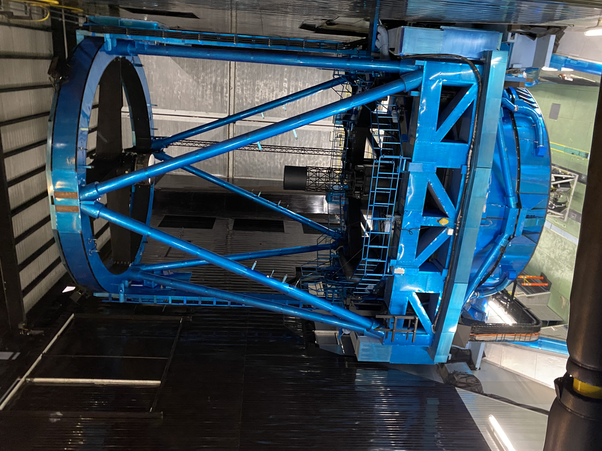
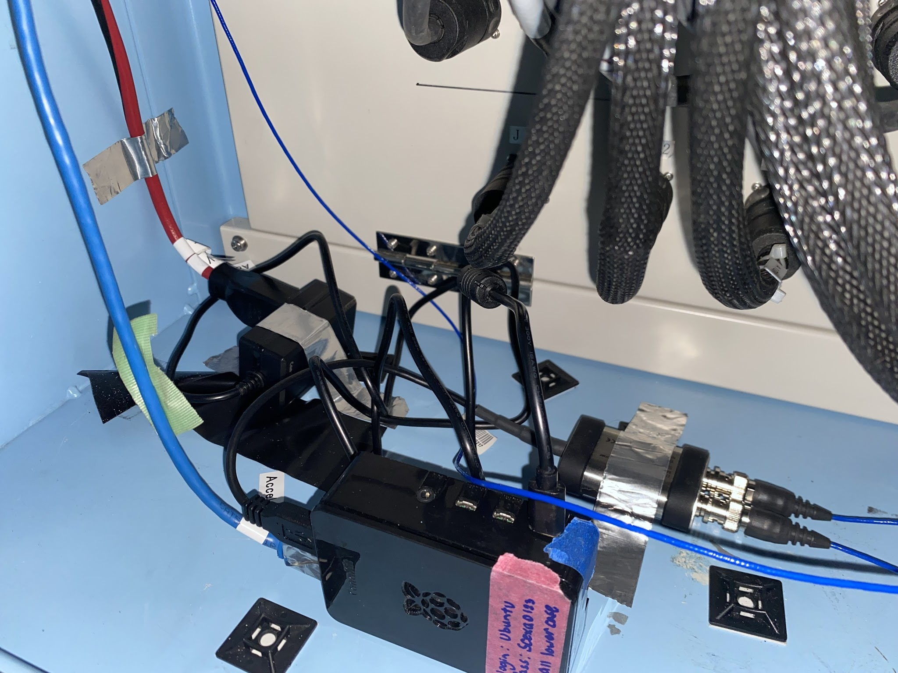
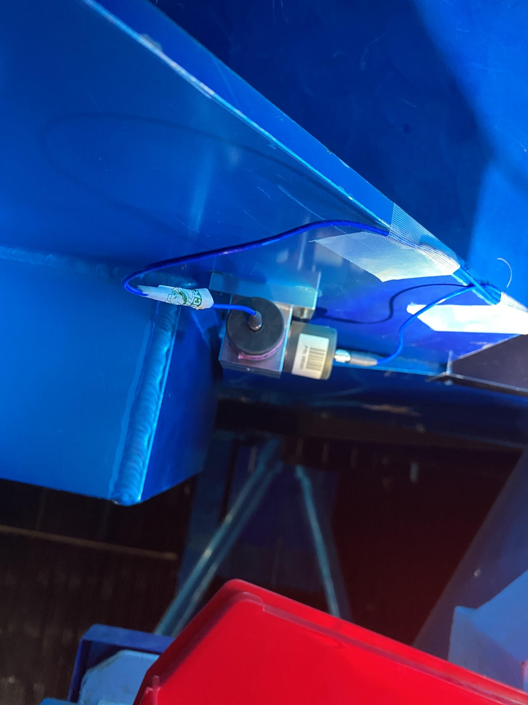
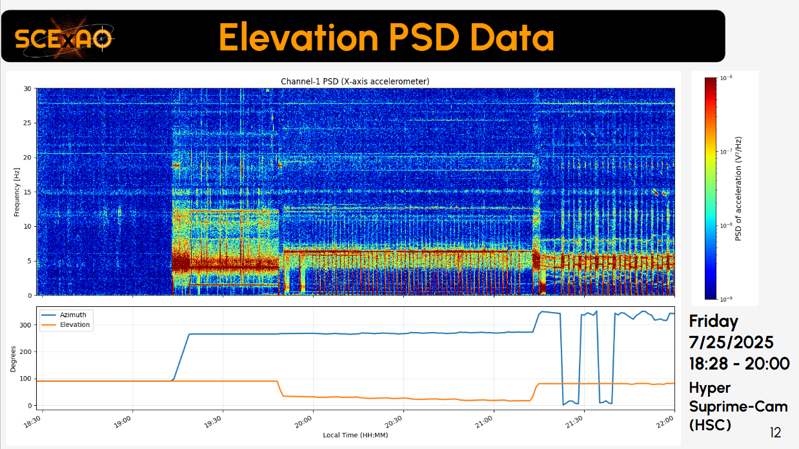

  
  
  
  

Ground-based telescopes like Subaru face two dominant sources of pointing disturbances:
atmospheric turbulence and mechanical vibrations. While turbulence is broadband and random,
mechanical vibrations typically occur at discrete frequencies tied to hardware components. These
vibrations affect high-contrast imaging systems, particularly the Subaru Coronagraphic Extreme
Adaptive Optics (SCExAO) instrument, causing blur in the captured image. Prior vibration studies
using SCExAO revealed that low-frequency disturbances—below 10 Hz—originated from the
telescope itself. These vibrations were characterized using accelerometers, with frequency patterns
correlating to the telescope’s rotational speeds. To correct for these vibrations, a low-latency
correction system is being developed using accelerometer real-time data. The accelerometers
connect to an Integrated Circuit Piezoelectric (ICP) signal conditioner that provides excitation
current and removes the DC bias from the output signal. The conditioned signal is then digitized
through an analog-to-digital converter (ADC) and read by a Raspberry Pi 4 as a USB Type 1 class
audio stream at an 8kHz sampling rate. A C program utilizing the PortAudio library reads the data
and then writes it to shared memory via the Multi-purpose Imaging Libraries toolKit (milk),
enabling real-time data streaming over Ethernet to the SCExAO server. This system is installed
on the top ring of the telescope to provide real-time vibration measurements and data logging,
which will be used to create and implement a linear control model to actuate the adaptive optics
tip-tilt mirror for vibration correction. This system aims to enhance image stability and improve
overall SCExAO performance, particularly during sensitive, high-contrast observations.

You can learn more here [GitHub Repository](https://github.com/JiaJunLi526/VibrationControlSystem).
