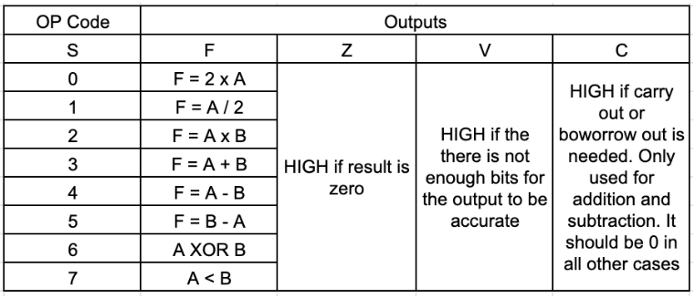

<div class="text-center p-4">
  
  
  
  
</div>

This final project for ECE 260 involved solving truth tables, simulating circuits in Falstad, and coding the design in Verilog with its corresponding testbench. The project helped me understand key CPU operations and the process of manually designing each module.

I began by creating the truth tables for each operation, then used Karnaugh maps (K-maps) to derive and simplify the Boolean equations. With these simplified equations, I started wiring the logic in the Falstad circuit simulator. For each operation, I built and saved a separate module, then combined all the modules using a multiplexer to control which operation was executed.

Through this project, I gained valuable experience in deriving K-maps from truth tables and applying Boolean algebra to simplify equations. More importantly, I was able to see how these fundamental tools can be used to build larger, real world systems.

This is the verilog code:
```verilog
module ALU (
  input  [3:0] a, b,
  input  [2:0] s,
  output [3:0] F,
  output Z, V, C
);

  reg [7:0] out;
  
  always @(*) begin
    case (s)
      3'b000: out = 2 * a;
      3'b001: out = a / 2;
      3'b010: out = a * b;
      3'b011: out = a + b;
      3'b100: out = a - b;
      3'b101: out = b - a;
      3'b110: out = a ^ b;
      3'b111: out = a < b;
      default: out = 0;
    endcase
  end

  assign Z = (out == 4'd0);
  assign V = (out > 127 || out < -128);
  assign C = (s == 3'b011 && (out[4] | (a[3] & b[3]))) 
          || (s == 3'b100 && (a[3] < b[3])) 
          || (s == 3'b101 && (b[3] < a[3]));
  assign F = out[3:0];
  
endmodule
```

        
          
        
