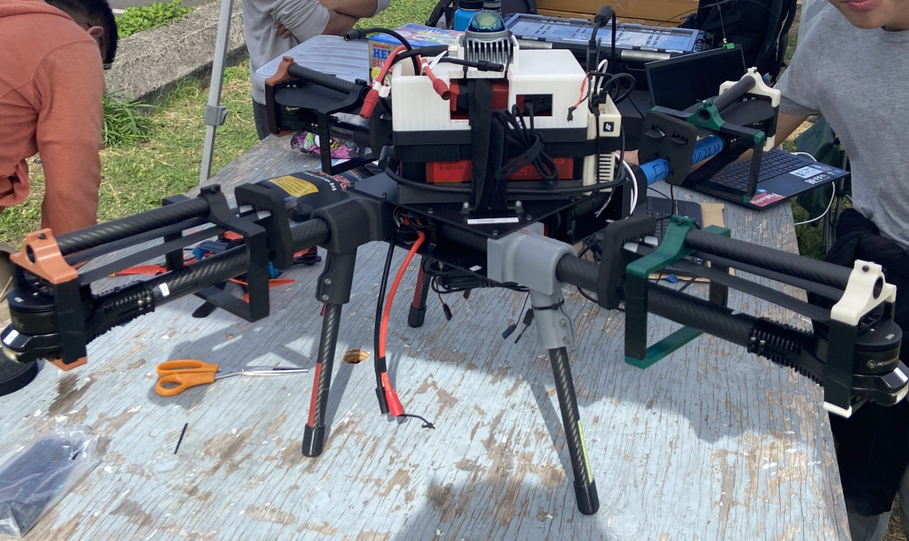
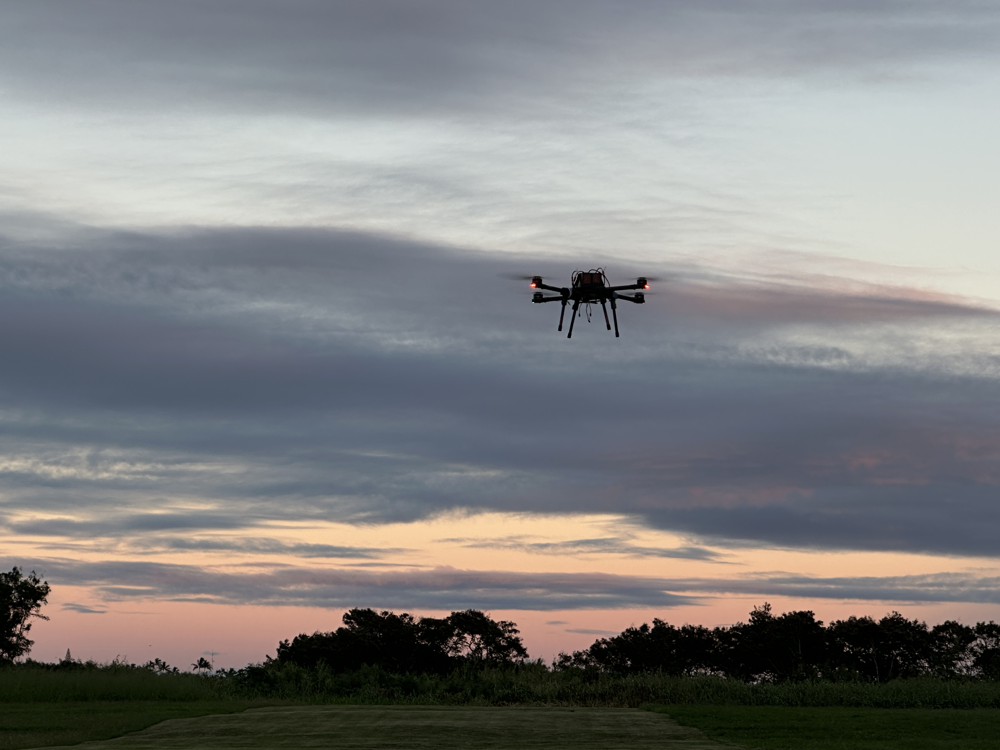

  
  

A Vertically Integrated Project (VIP) brings together faculty mentors, graduate researchers, and undergraduate students from freshmen to seniors. Senior members of the team (faculty, graduate students, and upper-division undergraduates) mentor the more junior members.

UHDT is a project focused on developing autonomous UAVs for search and rescue missions and, more recently, for unexploded ordnance detection and mapping. The UHDT team consists of 40+ members across mechanical, electrical, and computer engineering. I became a member in Fall 2023 and was appointed software subsystem lead in Spring 2025, where I focus on autonomous navigation and related capabilities.

My first major effort was integrating a LiDAR sensor into the Ardupilot software for obstacle detection. I set up a ROS workspace and installed the Livox LiDAR SDK package. After configuring the launch files, I successfully streamed point cloud data into Rviz. I then published the point cloud data to Ardupilot, enabling the flight controller to detect obstacles. Currently, I am setting up the Gazebo simulator for software-in-the-loop testing of both static and dynamic obstacle avoidance.

Another key task was transitioning the Python DroneKit codebase into a ROS framework using MAVROS. I set up the ROS workspace, installed MAVROS and the MavLink package, and experimented with various methods for dynamic waypoint navigation. Ultimately, I settled on sending GlobalPositionTarget messages through the mavros_msgs and into the flight controller, which provided a reliable way to update waypoints dynamically. I then refactored the old DroneKit functions into MAVROS equivalents. Finally, I combined the LiDAR and MAVROS workspaces, creating a unified ROS framework that is ready for future integrations.

